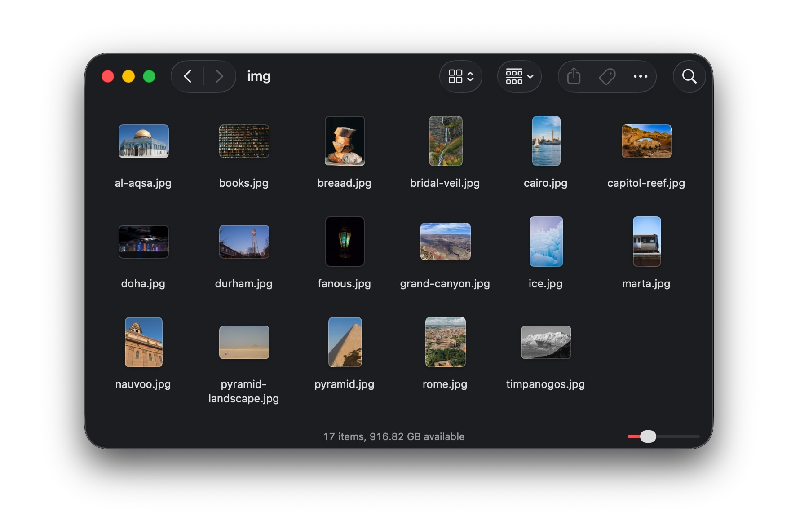
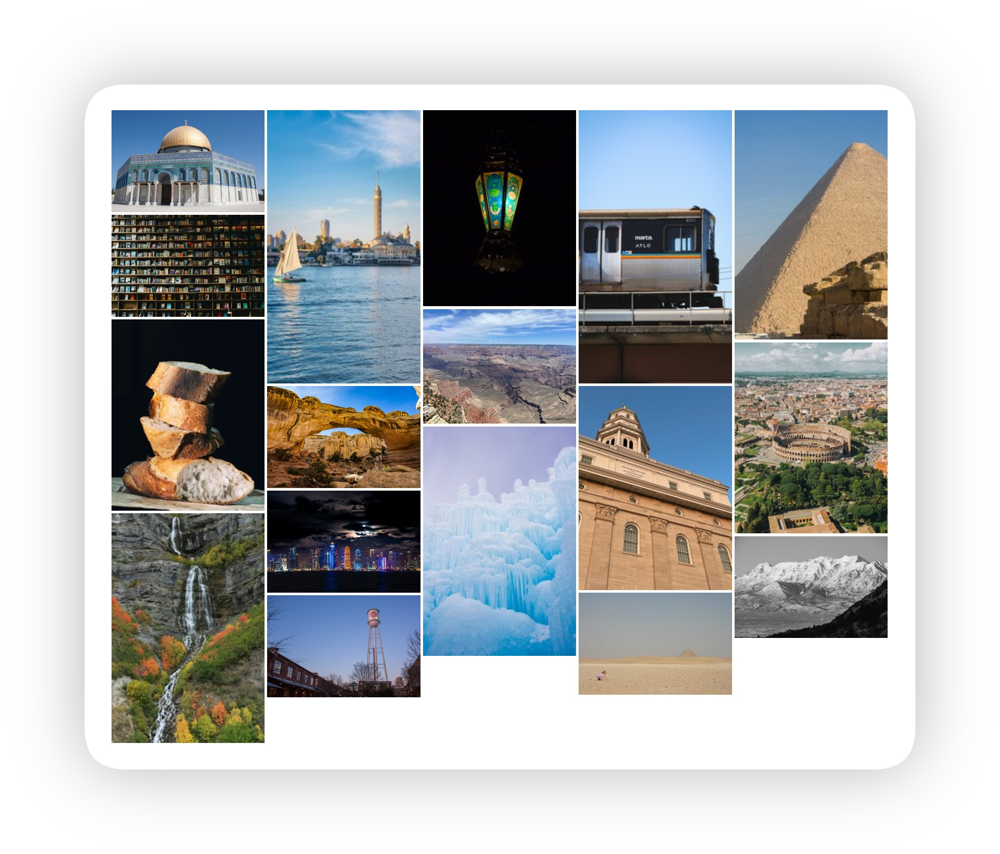

## Overview

This Quarto extension lets you point to a folder of images and automatically create a static photo gallery using [PhotoSwipe](https://photoswipe.com/). Through some Python magic, the extension automatically generates thumbnails, extracts metadata (including EXIF data), and builds a PhotoSwipe-based gallery. Place the gallery wherever you want on your page with a shortcode.

Put simply, it lets you go from this:



…to this:



## Demo

Visit the demo website to see it in action (and see all the different possible settings).

## Requirements

In addition to Quarto, you need to install [uv](https://docs.astral.sh/uv/), which will allow you to install a project-specific version of Python and all other necessary packages.

Follow the [installation instructions](https://docs.astral.sh/uv/getting-started/installation/) for your specific operating system.

## Installation

Make sure you [install uv first](https://docs.astral.sh/uv/getting-started/installation/)!

To install this extension in your current directory (or into the Quarto project that you're currently working in), use the following terminal command:

```{.bash filename="Terminal"}
quarto add andrewheiss/quarto-static-photo-gallery
```

This will install the extension in the `_extensions` subdirectory. If you're using version control, you will want to check in this directory.

## Usage

Add settings to your document's YAML frontmatter…

```{.yaml}
---
title: My Photos
extensions:
  photo-gallery:
    # Path to your image folder
    album-files: img
    # justified | masonry | grid
    layout: justified
    # Target row height in px (in the justified layout)
    thumbnail-height: 300
    # gap between images in px
    gap: 5
---
```

…and place the shortcode wherever you want the gallery to appear in your document:

```{.markdown}
Here are some beautiful photos:



And here's some more text.
```

## Configuration

There are lots of possible options! Each of these can be set either in frontmatter under `extensions: photo-gallery:` or as arguments in the shortcode.

| Option | Default | Description |
|---|---|---|
| `album-files` | `img` | Path to the image folder (relative to the `.qmd` file) |
| `layout` | `justified` | Gallery layout: `justified`, `masonry`, or `grid` |
| `thumbnail-height` | `300` | Target row height in px (drives justified layout; also the thumbnail resize target) |
| `thumbnail-max-width` | `1200` | Max thumbnail long edge in px |
| `thumbnail-quality` | `85` | JPEG quality for generated thumbnails (1–95) |
| `columns` | `3` | Number of columns for `masonry` and `grid` layouts |
| `gap` | `4` | Gap between images in px |
| `show-exif` | `true` | Show camera/lens/exposure data in the caption area |
| `show-date` | `true` | Show the date taken in the caption area |
| `date-format` | `YYYY-MM-DD` | [Day.js format string](https://day.js.org/docs/en/display/format) for date-only timestamps |
| `datetime-format` | `YYYY-MM-DDTHH:mm` | [Day.js format string](https://day.js.org/docs/en/display/format) for timestamps that include a time component |
| `show-download` | `true` | Show a download button in the PhotoSwipe lightbox toolbar |
| `transition` | `zoom` | Lightbox open/close animation: `zoom`, `fade`, or `none` |
| `show-bullets` | `false` | Show dot navigation indicator in the PhotoSwipe lightbox |

Shortcode arguments take precedence over frontmatter for that call only, so you can set global defaults in frontmatter and override per-gallery as needed.

The album folder can also be passed as a bare positional argument:

```markdown

```

Any combination of arguments works:

```{.markdown}



```

## Image folder structure

The extension will process a folder of images without looking in subfolders. It will automatically generate thumbnail versions in `thumbs/`. It will use a file named `album.yml` for additional metadata if present.

```{.default}
img/
├── photo1.jpg     ← a picture
├── photo2.jpg     ← a picture
├── album.yml      ← optional per-image metadata
└── thumbs/        ← auto-generated on first render
    ├── photo1.jpg
    └── photo2.jpg
```

Supported image formats: `.jpg` / `.jpeg`, `.png`, `.webp`, `.tif` / `.tiff`

Generated thumbnails are put in a `thumbs/` subfolder inside your image folder and are only regenerated if the source image is newer than the existing thumbnail. You can safely add `thumbs/` to `.gitignore` and regenerate at build time, or you can commit the thumbnails to skip the generation step on subsequent renders.

## Per-image metadata (`album.yml`)

Place an `album.yml` file inside your image folder to override titles, descriptions, dates, or alt text for specific images. Any field you omit falls back to EXIF data or a title derived from the filename.

```yaml
# img/album.yml
images:
  photo1.jpg:
    title: "Horseshoe Bend at Sunset"
    description: "Shot from the rim with a wide-angle lens"
    date: "2024-08-14"   # overrides EXIF date

  photo2.jpg:
    title: "Forest Trail"
    description: "Photo by [Jane Smith](https://example.com) · CC BY 4.0"
    alt: "A narrow dirt trail winding through a dense old-growth forest in autumn"
    # date comes from EXIF
```

## Captions

Captions appear in two places: as a hover overlay on each thumbnail, and in the footer of the lightbox when you navigate the full-size images. Each caption has up to three lines:

```{.default}
Title
Metadata
Description
```

- **Title**: The title comes from the `album.yml` title; if not present, the filename is used instead

- **Metadata**: Metadata comes from EXIF data in the file, if present. It appears as a dot-separated string like this:

  ```{.default}
  2026-06-12 · f/1.8 · 1/200s · 85mm · ISO 800 · Nikon D7200
  ```

  Dates are stored as canonical ISO 8601 strings: `2026-06-12T14:09` when the date includes a time, and `2026-06-12` when only a date is available. The `date-format` and `datetime-format` options control display using [Day.js format tokens](https://day.js.org/docs/en/display/format).

  The `date` field in `album.yml` accepts ISO 8601 date or datetime strings:

  ```{.yaml}
  images:
    photo1.jpg:
      date: "2026-06-12"
    photo2.jpg:
      date: "2026-06-12T14:09"
  ```

- **Description**: You can use *some* inline Markdown in the description field in `album.yml`. Whatever you do needs to live inside a single paragraph, so you can use things like links, bold, italic, etc. and not things like lists, headings, etc.

You can override any caption element with CSS in your document or theme. The same class names apply in both the thumbnail overlay and the lightbox footer; use the `.pswp__pg-caption` parent selector to target the lightbox only.

```{.css}
/* Thumbnail overlay caption */
.pg-caption     { /* overlay container  */ }
.pg-title       { /* image title        */ }
.pg-meta        { /* date + EXIF stuff  */ }
.pg-description { /* description text   */ }

/* Lightbox footer caption */
.pswp__pg-caption                 { /* lightbox caption container */ }
.pswp__pg-caption .pg-title       { /* image title                */ }
.pswp__pg-caption .pg-meta        { /* lightbox caption container */ }
.pswp__pg-caption .pg-description { /* lightbox caption container */ }
```

## Alt text

The `alt` field in `album.yml` sets the `alt` attribute for both the thumbnail and the full-size lightbox image. If `alt` is omitted, the plain-text, markdown-free content of `description` is used instead. But try not to rely on that! Alt text should describe what is depicted instead of just replicating the caption---[see Section508.gov's guide for additional examples](https://www.section508.gov/create/alternative-text/).

## Multiple galleries per page

You can include multiple galleries on a page by pointing to different folders:

```{.markdown}
## Travel Photos



## Portraits


```

You can pass an `id` value too, which can be helpful if you want to target it with CSS:

```{.markdown}
## Travel Photos



## Portraits


```

## Credits

The example images are used under the [Unsplash license](https://unsplash.com/license):

- [Mountains](https://images.unsplash.com/photo-1506905925346-21bda4d32df4)
- [Forest](https://images.unsplash.com/photo-1448375240586-882707db888b)
- [Ocean](https://images.unsplash.com/photo-1505118380757-91f5f5632de0)
- [City at night](https://images.unsplash.com/photo-1477959858617-67f85cf4f1df)
- [Desert](https://images.unsplash.com/photo-1509316785289-025f5b846b35)
- [Flowers](https://images.unsplash.com/photo-1490750967868-88df5691cc65)
- [Waterfall](https://images.unsplash.com/photo-1434394354979-a235cd36269d)
- [Snow](https://images.unsplash.com/photo-1517299321609-52687d1bc55a)
- [Canyon](https://images.unsplash.com/photo-1474044159687-1ee9f3a51722)
- [Lake](https://images.unsplash.com/photo-1439853949212-36089b13f1e8)

## License

MIT
